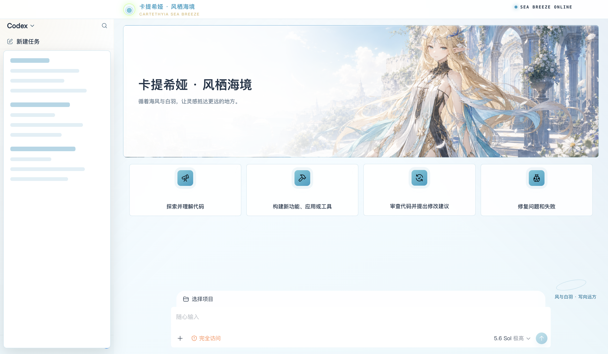
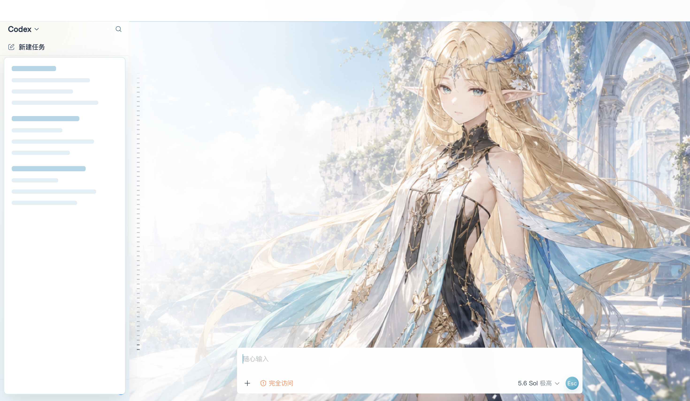
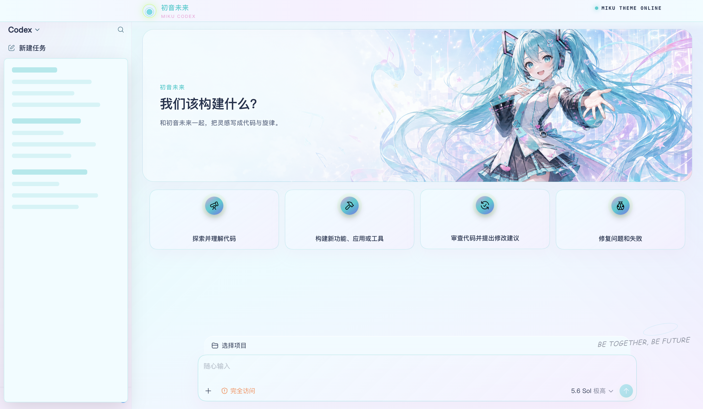
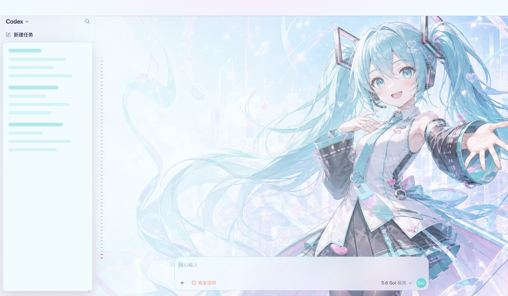
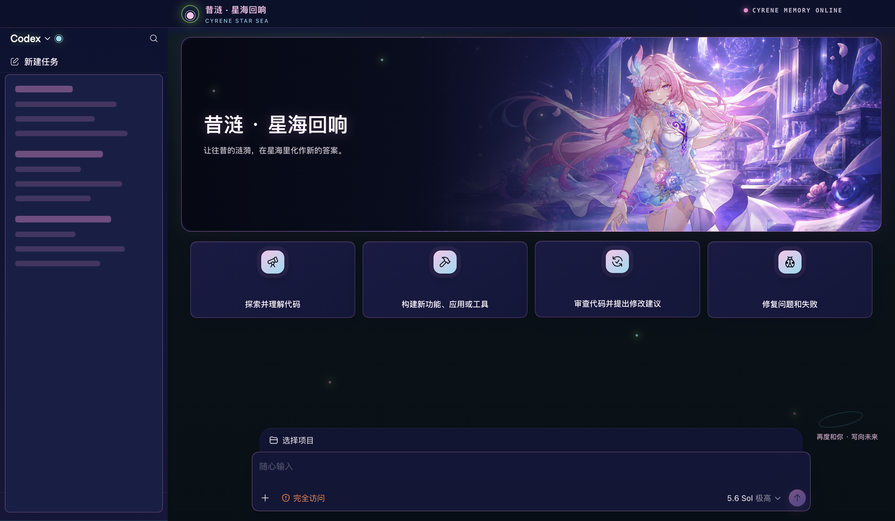
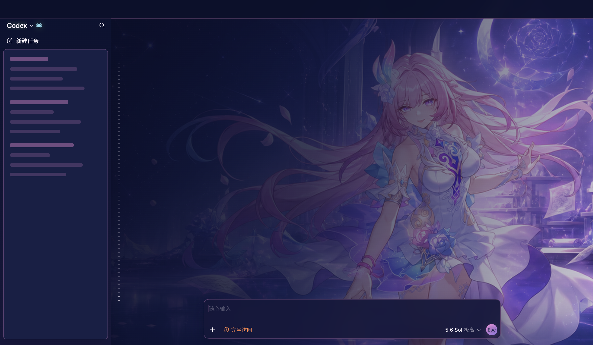

# Codex 皮肤管理器

<p align="center">
  <strong>中文</strong> · <a href="./README.en.md">English</a>
</p>

<p align="center">
  为 Codex 桌面端提供可切换、可创建、可导入、可恢复的完整主题系统。<br>
  原生侧栏、对话、项目选择器和输入框保持可交互，不使用整窗伪 UI 图片。
</p>

<p align="center">
  <a href="https://github.com/Fei-Away/Codex-Dream-Skin/releases">下载发行版</a>
  ·
  <a href="./docs/theme-format.md">主题格式</a>
  ·
  <a href="./docs/platforms.md">平台说明</a>
</p>

> 非 OpenAI 官方产品。本项目通过仅监听本机回环地址的 CDP 注入主题，不修改官方 `.app`、`app.asar`、WindowsApps 文件或代码签名。

## 界面展示

<table>
  <tr>
    <th width="50%">初始页</th>
    <th width="50%">对话页</th>
  </tr>
  <tr>
    <td></td>
    <td></td>
  </tr>
  <tr>
    <td colspan="2" align="center"><strong>卡提希娅 · 风栖海境</strong></td>
  </tr>
  <tr>
    <td></td>
    <td></td>
  </tr>
  <tr>
    <td colspan="2" align="center"><strong>初音未来</strong></td>
  </tr>
  <tr>
    <td></td>
    <td></td>
  </tr>
  <tr>
    <td colspan="2" align="center"><strong>昔涟 · 星海回响</strong></td>
  </tr>
</table>

展示图来自真实 Codex 页面。对话内容、任务名称和侧栏项目等隐私区域已在截图阶段隐藏，仅保留主题背景与原生界面结构。

## 功能

- 内置 14 套外观，Codex 默认原版始终置顶
- macOS 与 Windows 均提供图形主题管理器和一键切换
- 软件内选择图片创建主题，自动裁切 `2400x800` 主图和 `1200x400` 预览图
- 内置 Codex 主题创建 Skill，可通过对话生图、创建主题并自动加入管理器
- 可调横向图片焦点、浅色/暗色模式、分类、作者和三组主题色
- 严格导入 schema 2 主题包，校验目录、字段、PNG、3:1 比例和文件大小
- 首页、聊天页、插件页、技能页、侧栏、输入器和通知统一适配主题
- 主题切换后宠物层始终保持显示
- 一键恢复 Codex 官方原版外观

## 安装

从 [Releases](https://github.com/Fei-Away/Codex-Dream-Skin/releases) 下载对应平台的安装包。

### macOS

1. 打开 `Codex 皮肤管理器 1.5.0.dmg`。
2. 双击 `安装 Codex 皮肤管理器.app`。
3. 点击“一键安装”，安装完成后会自动打开主题管理器。

安装位置：

```text
应用：~/Applications/Codex 皮肤管理器.app
引擎：~/.codex/codex-dream-skin-studio
主题：~/Library/Application Support/CodexDreamSkinStudio/themes
```

### Windows

1. Codex 可以保持运行。
2. 运行 `Codex-Skin-Manager-Setup-1.5.0.exe`。
3. 安装完成后打开开始菜单中的“Codex 皮肤管理器”。

`1.4.1` 起支持运行中直接安装；当前窗口保持开启，首次切换主题时再按提示应用。

安装位置：

```text
引擎：%LOCALAPPDATA%\CodexDreamSkin\engine-1.5.0
主题：%LOCALAPPDATA%\CodexDreamSkin\themes
运行状态：%LOCALAPPDATA%\CodexDreamSkin
```

## 创建主题

在主题管理器中点击“创建主题”：

1. 选择 PNG、JPEG、WebP、HEIC 等常见图片。
2. 调整横向焦点，让人物或主要视觉中心落在合适位置。
3. 填写名称、主题 ID、作者、描述和分类。
4. 选择浅色或暗色界面，设置强调色、辅助色和点缀色。
5. 点击“创建主题”，新主题会立即加入本机主题库。

软件会自动生成标准的三个文件，并固定 `avatarOverlay` 为 `show`：

```text
my-theme/
├── theme.json
├── background.png
└── preview.png
```

### 通过 Codex Skill 创建

安装器会把仓库内的 [`skill/codex-skin-theme-creator`](./skill/codex-skin-theme-creator) 安装到 Codex 的 Skill 目录，也可以在管理器“接入标准”页检查或重新安装。

```text
macOS：${CODEX_HOME:-~/.codex}/skills/codex-skin-theme-creator
Windows：%CODEX_HOME%\skills\codex-skin-theme-creator
```

安装后可直接对 Codex 说：

```text
用这张图创建一套浅色 Codex 主题，名字叫“水色工作台”
```

也可以只给出视觉要求：

```text
创建一套暗色星空主题，人物放在画面右侧，左边保留清晰环境，名字叫“星海工作台”
```

Skill 会按管理器当前创建规范调用图像生成能力或处理已有图片，生成主图、预览图和清单，并原子写入用户主题库。管理器打开时会自动检测新主题，无需重启或手工导入。详细执行规范和命令见 [Skill 说明](./skill/codex-skin-theme-creator/SKILL.md)。

## 导入主题

点击“导入主题”，选择主题文件夹。导入器只复制上述三个标准文件，并执行以下检查：

- `schemaVersion` 必须为 `2`
- ID 仅使用小写字母、数字和连字符
- `style` 必填，`appearance` 必须为 `auto`、`light` 或 `dark`
- `image` / `preview` 固定为标准文件名
- 两张图片必须是真实 PNG 且为精确 3:1
- `avatarOverlay` 必须为 `show`
- 不接受 `taskImage`、符号链接和越界路径
- 内置主题 ID 受保护；同 ID 自定义主题需确认后替换

完整字段、尺寸和示例见 [主题格式文档](./docs/theme-format.md)。

## 内置主题

| 顺序 | 主题 |
|---:|---|
| 1 | Codex 默认原版 |
| 2 | 月薪喵打卡 |
| 3 | 初音未来 |
| 4 | 奶龙晴空 |
| 5 | 昔涟 · 星海回响 |
| 6 | 蔚蓝档案 · 青春合影 |
| 7 | 卡提希娅 · 风栖海境 |
| 8 | 芙宁娜 · 水色剧场 |
| 9 | 流萤 · 星海微光 |
| 10 | Saber · 誓约胜利 |
| 11 | 明日香 · 红色黄昏 |
| 12 | 蕾姆 · 冰蓝夜庭 |
| 13 | OpenAI 是人民的 AI |
| 14 | KUN 黑金舞台 |

## 工作原理

```text
主题管理器
  ├─ 管理 schema 2 主题包
  ├─ 启动官方 Codex 并启用 loopback CDP
  └─ 注入 CSS、主题变量与少量装饰 DOM
                │
                ▼
官方 Codex 原生界面、对话和输入器继续工作
```

运行时只连接 `127.0.0.1`，并校验 Codex 进程、调试端口和渲染目标。恢复操作会停止注入器并还原外观配置。

## 从源码运行

克隆完整仓库：

```bash
git clone https://github.com/Fei-Away/Codex-Dream-Skin.git
cd Codex-Dream-Skin
```

### macOS

```bash
cd macos
npm test
./scripts/install-dream-skin-macos.sh --no-launch
./scripts/build-studio-app-macos.sh "$HOME/Desktop/Codex 皮肤管理器.app"
```

要求：macOS 14 或更新版本、官方 Codex Desktop，以及 Xcode Command Line Tools。

### Windows

```powershell
powershell -ExecutionPolicy Bypass -File windows\tests\run-tests.ps1
powershell -ExecutionPolicy Bypass -STA -File windows\scripts\theme-manager.ps1
```

要求：Windows 10/11、Microsoft Store 版 Codex。安装包自带 Node.js 运行时。

## 构建发行包

macOS DMG：

```bash
macos/scripts/build-installer-dmg-macos.sh \
  "$HOME/Desktop/Codex 皮肤管理器 1.5.0.dmg"
```

Windows NSIS 安装包：

```bash
brew install nsis
windows/scripts/build-installer-windows.sh
```

Windows 产物位于 `windows/release/Codex-Skin-Manager-Setup-1.5.0.exe`。正式发布前应在真实 Windows 环境运行 PowerShell 回归和安装/卸载测试。

## 项目结构

```text
macos/                         macOS Studio、安装器、运行时和内置主题
windows/                       Windows 管理器、NSIS、运行时和内置主题
skill/codex-skin-theme-creator Codex 主题创建 Skill
docs/images/showcase/          README 脱敏展示图
docs/theme-format.md           schema 2 主题规范
docs/platforms.md              平台路径与能力对照
script/                        文档截图等维护脚本
```

维护者可在 Codex 已通过 CDP 启动时重新生成三套脱敏展示图：

```bash
/Applications/ChatGPT.app/Contents/Resources/cua_node/bin/node \
  script/capture-readme-showcase.mjs
```

## 贡献

提交主题或功能修改前：

- 阅读 [AGENTS.md](./AGENTS.md) 和 [主题格式](./docs/theme-format.md)
- macOS 改动运行 `cd macos && npm test`
- Windows 改动运行 `powershell -File windows/tests/run-tests.ps1`
- 视觉改动附首页与聊天页截图
- 不提交 API Key、`auth.json`、私有聊天、客户数据或带隐私的截图

Issue 和 PR 请使用仓库内模板。

## 赞助

感谢 [passion8.cc](https://passion8.cc/register?aff=TuPe) 赞助本项目。主题功能与 API 配置彼此独立，本项目不会自动改写 API Key、Base URL 或模型供应商配置。

## 许可与声明

- 代码使用 [MIT License](./LICENSE)
- 资源来源和生成记录见 [asset-provenance.md](./macos/references/asset-provenance.md)
- 本项目与 OpenAI 无隶属关系；Codex 及相关标识归其权利人所有
- 内置角色主题仅作个人主题示例；公开再分发或商业使用前请确认相应素材、角色和商标权利
